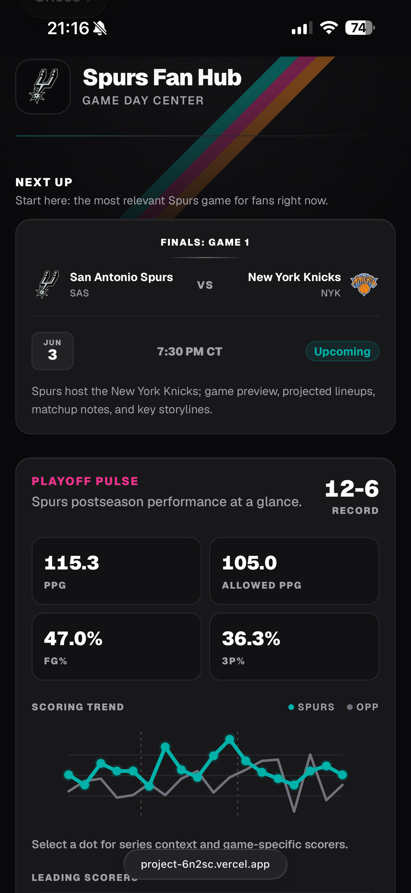
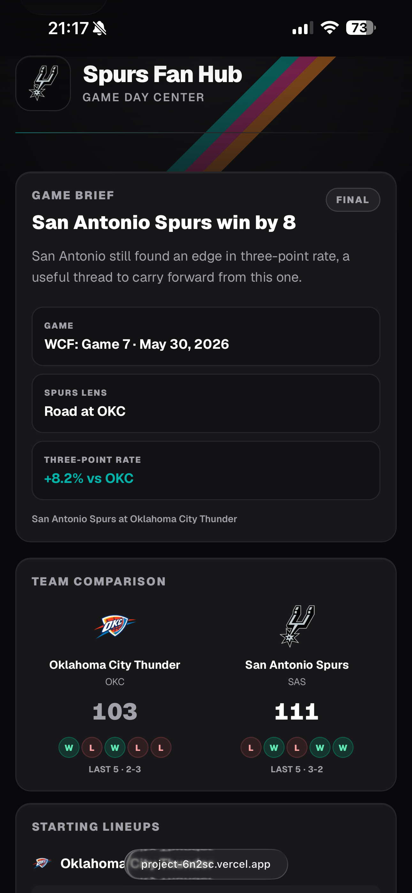
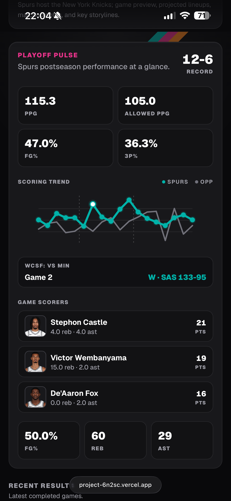
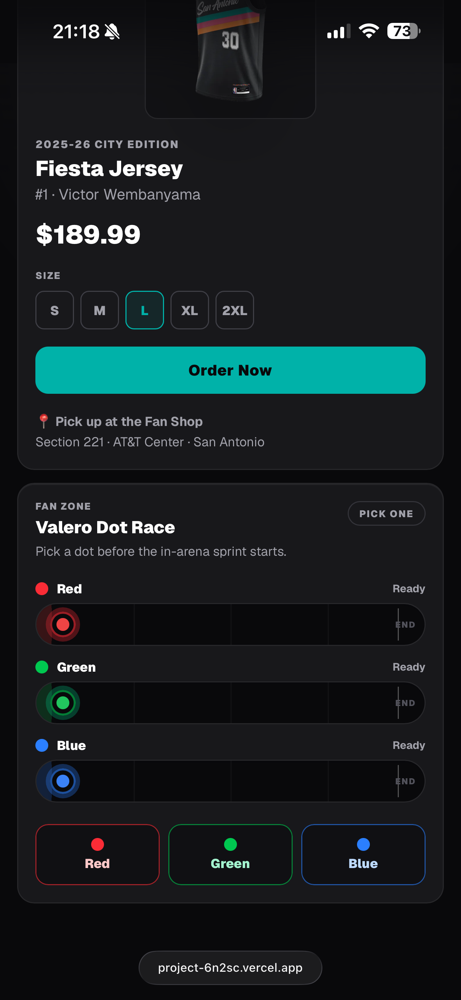

# Spurs Fan Hub

A responsive Game Day Fan Hub for San Antonio Spurs fans. The app helps a fan scan the most relevant upcoming or recent Spurs game, open a matchup brief, compare teams, review players, and explore postseason performance using normalized Sportradar NBA data.

Live demo: https://project-6n2sc.vercel.app/
Repository: https://github.com/ElizabethGraham/fan-hub

## Screenshots

### Homepage

<p align="center">
  
</p>

### Game Detail

<p align="center">
  
</p>

### Playoff Pulse

<p align="center">
  
</p>

### Dot Race

<p align="center">
  
</p>

## Features

- Homepage with the most relevant Spurs game surfaced first, followed by Playoff Pulse, recent results, confirmed upcoming games, and conditional playoff games.
- Game detail pages with a Spurs-focused game brief, team comparison, players to watch, starting-lineup context, interactive stat charts, and a fan-shop/fan-zone experience.
- Playoff Pulse module showing Spurs postseason record, averages, scoring trend, series boundaries, and leading scorers.
- Interactive charts powered by real Sportradar box-score data, including quarter scoring and period-level stats when available.
- Valero Dot Race fan-zone feature: pick a dot, get locked in with a 3-2-1 countdown, watch the race, and win a fan-shop discount on a correct prediction.
- Server-side Sportradar integration so API keys are never exposed in the browser.
- SEO metadata for the homepage and game pages.
- Responsive dark UI with Fiesta-inspired accents, keyboard-accessible controls, alt text, and a skip link.

## Tech Stack

- Next.js 16 App Router
- React 19
- TypeScript
- Tailwind CSS v4
- Sportradar NBA API
- Vitest and Testing Library
- Vercel-ready deployment

## Getting Started

### Prerequisites

- Node.js 20 recommended
- npm
- Sportradar NBA API key

### Install

```bash
npm install
```

Create `.env.local`:

```bash
SPORTRADAR_API_KEY=your_sportradar_api_key
SPORTRADAR_ACCESS_LEVEL=trial
NEXT_PUBLIC_SITE_URL=http://localhost:3000
```

`SPORTRADAR_ACCESS_LEVEL` can be `trial` or `production`, depending on the account. `NEXT_PUBLIC_SITE_URL` is used for metadata/canonical URL generation and should be changed to the deployed URL in production.

Run locally:

```bash
npm run dev
```

Open `http://localhost:3000`.

## Scripts

```bash
npm run dev      # local development
npm run lint     # ESLint
npm test         # Vitest test suite
npm run build    # production build
npm run start    # run the production build
npm run format
```

## Architecture

```text
app/
  layout.tsx                Root layout, font loading, metadata shell
  page.tsx                  Homepage data assembly and rendering
  loading.tsx               Homepage skeleton
  game/[id]/page.tsx        Game detail page data assembly and rendering
  game/[id]/loading.tsx     Game detail skeleton

components/
  Layout.tsx                Shared page shell (header, footer)
  GameCard.tsx              Schedule/result card
  FeaturedGame.tsx          Hero card for the most relevant game
  GameSection.tsx           Labeled group of GameCards
  DateBadge.tsx             Game date/time pill
  PlayoffSnapshot.tsx       Interactive postseason summary
  KeyMatchup.tsx            Spurs-focused matchup brief
  TeamComparison.tsx        Side-by-side team stat comparison
  GameCharts.tsx            Interactive team/period charts
  PlayersToWatch.tsx        Player spotlight cards
  StartingLineups.tsx       Projected starter display
  PlayerAvatar.tsx          Player headshot with initials fallback
  JerseyShop.tsx            Fan-shop jersey carousel
  DotRaces.tsx              Valero Dot Race fan-zone experience

lib/
  sportradar.ts             Server-only Sportradar API client
  sportradarMapper.ts       Raw API to app display model normalization
  schedule.ts               Cached schedule loading
  gameDetailData.ts         Game detail page data assembly and metadata
  homePageData.ts           Homepage data assembly
  gameDisplay.ts            Display helpers and game status utilities
  playoffs.ts               Spurs playoff round label mapping
  nba.ts                    NBA CDN URL helpers (logos, headshots)
  flags.ts                  Feature flags via Flags SDK
  constants.ts              Shared constants (team alias, timezone, etc.)
  serverLogger.ts           Server-side structured logging
  types.ts                  Shared TypeScript models
```

## Data Flow

1. Server Components call `lib/homePageData.ts` or `lib/gameDetailData.ts` to assemble page data.
2. Those modules call `lib/sportradar.ts` (server-only) to fetch from the Sportradar API.
3. Raw Sportradar responses are normalized in `lib/sportradarMapper.ts` into typed display models.
4. UI components receive typed display models from `lib/types.ts`.
5. The browser never receives the Sportradar API key.

## Caching Strategy

- Season schedule data is cached with `unstable_cache` because it changes infrequently.
- Game summaries and box scores revalidate every two hours for this assessment to reduce API pressure.
- In production, active/live games would use a much shorter revalidation interval or tag-based invalidation.
- Team profiles, depth charts, and season stats use longer revalidation windows because they change less often.

## Product Decisions

- The homepage prioritizes the most relevant current fan task: the next confirmed game, live game, or latest result. Conditional playoff games are intentionally lower in the page until they become official.
- All editorial copy is Spurs-centered. Opponent strengths can appear as context, but the UI avoids celebrating other teams.
- Playoff round labels are hardcoded in `lib/playoffs.ts` because the Sportradar schedule includes game titles such as `Game 1` but not the specific round label needed for a polished fan experience.
- Charts use real API data only. When period-level stats are unavailable, the app falls back to the verified data it does have rather than generating synthetic values.
- No database or auth layer is included because the assessment asks for a focused read-only sports experience.

## Accessibility and SEO

- Semantic headings and landmarks.
- Skip link for keyboard users.
- Keyboard-operable chart selections.
- `aria-pressed`/`aria-live` where controls update visible analysis.
- Team logos, player images, and product images include alt text.
- Homepage and game pages define metadata for title, description, Open Graph, and Twitter cards.
- Text contrast and sizing are tuned for readability on the dark theme.

## Testing

The test suite covers key mapping and component behavior:

```bash
npm test
```

Current focus areas:

- Sportradar box-score and period-stat normalization.
- Game card playoff title formatting.
- Component rendering for core UI sections.

## Deployment

Required environment variables:

```bash
SPORTRADAR_API_KEY=...
SPORTRADAR_ACCESS_LEVEL=trial
NEXT_PUBLIC_SITE_URL=https://your-deployed-url.example
```

After deployment, update the Live demo link at the top of this README.

## Known Limitations

- Player headshots use NBA CDN URLs from Sportradar player reference IDs and gracefully fall back to initials when a CDN image is unavailable.
- Playoff round labels are intentionally hardcoded for the assessment dataset because SportRadar provides game numbers (e.g. "Game 7") but does not expose the corresponding playoff round.
- Live-game freshness is conservative for the assessment. A production game center should lower cache times during active games.
- Per quarter stats were not available in the free tier of the SR API.
- No persistent user preferences or favorites are included, but I would've liked to include that.

## Tradeoffs
- The application uses Next.js caching primitives rather than introducing a more complex external caching layer. This works well for a single deployment target, but if the application were scaled horizontally across multiple instances, I would likely introduce a shared caching layer (e.g., Redis) so instances could share cached data and avoid redundant cache warming.
- SportRadar provides game titles such as “Game 1” but does not provide playoff round context. Playoff round labels are intentionally hardcoded for this assessment. Given the scope and goals of the exercise, I prioritized architecture, testing, deployment, and UI/UX polish over building a more generalized playoff-stage derivation system.

## Assumptions
- The application is written for Spurs fans, so presentation is intentionally Spurs-centric.
- Opponent information is presented as context, but the UI avoids celebrating opposing teams.
- Reducing unnecessary API traffic is prioritized over minute-by-minute updates for non-live content.


## AI-Assisted Development

AI-assisted tools were used as a sounding board for technical discussions, alternative implementations, and code review. Suggestions were evaluated, modified, and tested before being incorporated into the project. For example, I used a combination of SportRadar documentation, Postman collections, and AI-assisted analysis to understand API response structures and evaluate integration approaches more quickly. All architecture, implementation, and debugging decisions were made manually.
